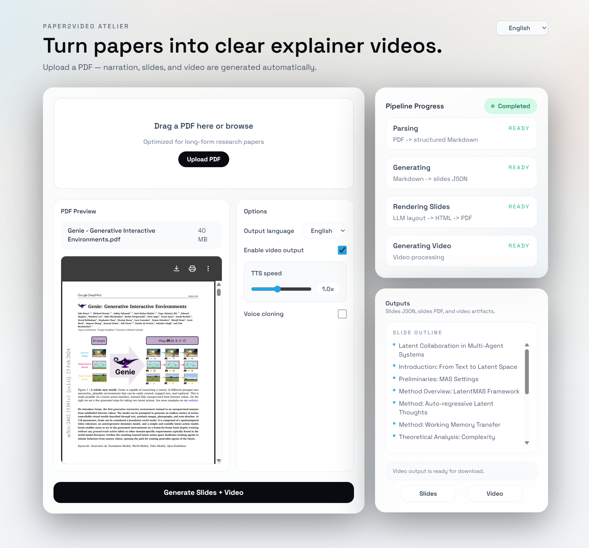

# Paper2Video Atelier



Transform dense academic papers into cinematic video explainers with AI-powered narration, automated slide generation, and professional video production.
[查看中文版](./README_CN.md)

## Features

- **PDF Analysis**: Extract structured content from research papers using Docling
- **Slide Generation**: AI-powered content summarization and slide layout design
- **Multi-language Support**: Generate slides and narration in English or Chinese
- **Voice Cloning**: Custom TTS with voice sample cloning capabilities
- **Video Production**: Automated video generation from slides with synchronized narration
- **Real-time Progress**: Track pipeline stages from parsing to final video rendering

## Prerequisites

### 1. Docling-serve with Podman

This project uses [Docling-serve](https://github.com/docling-project/docling-serve) for PDF parsing, which requires [Podman](https://podman.io/) to run containerized services.

**Install Podman:**

```bash
# Ubuntu/Debian
sudo apt-get update
sudo apt-get install -y podman

# Or follow the official installation guide for your OS
# https://podman.io/docs/installation
```

### 2. GPU Support (Optional but Recommended)

If you have an NVIDIA GPU and want to use GPU acceleration:

1. Install NVIDIA drivers for your system
2. Install nvidia-container-toolkit:

```bash
distribution=$(. /etc/os-release;echo $ID$VERSION_ID)
curl -s -L https://nvidia.github.io/nvidia-docker/gpgkey | sudo apt-key add -
curl -s -L https://nvidia.github.io/nvidia-docker/$distribution/nvidia-docker.list | \
  sudo tee /etc/apt/sources.list.d/nvidia-docker.list

sudo apt-get update
sudo apt-get install -y nvidia-container-toolkit
```

3. Generate CDI specification:

```bash
sudo nvidia-ctk cdi generate --output=/etc/cdi/nvidia.yaml
```

### 3. System Fonts for PDF Rendering

The slide rendering requires system fonts. For proper Chinese text rendering:

```bash
# Install Chinese fonts (Noto CJK)
sudo apt-get install fonts-noto-cjk

# You can also install additional fonts as needed
sudo apt-get install fonts-noto-color-emoji
```

## Installation

1. Clone the repository:

```bash
git clone <repository-url>
cd Paper2Video
```

2. Install dependencies using Bun:

```bash
# Install Bun if not already installed
curl -fsSL https://bun.sh/install | bash

# Install project dependencies
bun install
```

3. Configure environment variables:

```bash
cp .env.example .env
# Edit .env and configure your API keys and settings
```

## Usage

### Development Mode

Start the development server:

```bash
bun run dev
```

The application will be available at:
- **Next.js UI**: http://localhost:3000
- **Docling-serve API**: http://localhost:5001

### Production Build

Build for production:

```bash
bun run build
bun run start
```

## Configuration

### Environment Variables

See `.env.example` for available configuration options:

- `DOCLING_URL`: Docling-serve endpoint (default: `http://localhost:5001`)
- `LLM_API_KEY`: API key for LLM (for content generation)
- Additional TTS and video processing settings

## Contributing

Contributions are welcome! Please feel free to submit issues and pull requests.

## License

This project is licensed under the MIT License.

## Acknowledgments

- [Docling](https://github.com/docling-project/docling) for PDF parsing
- [Next.js](https://nextjs.org/) for the web framework
- [Reveal.js](https://revealjs.com/) for slide presentation
- [Puppeteer](https://pptr.dev/) for PDF generation
