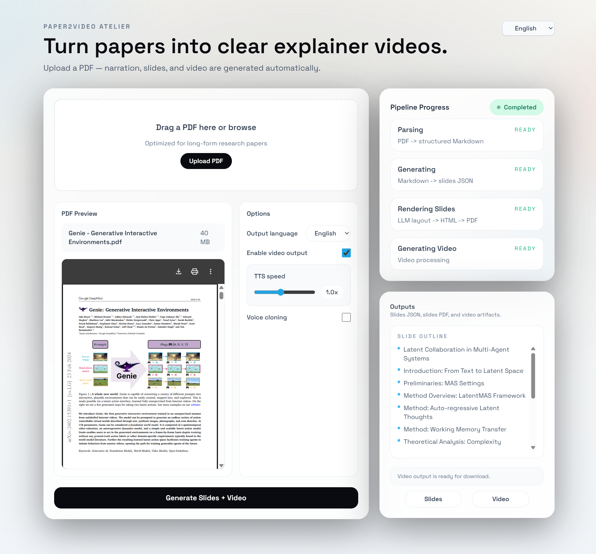

# Paper2Video Atelier



Transform academic papers into clear video explainers with AI-powered narration, automated slide generation, and professional video production.

[查看中文版](./README_CN.md)

## Features

- **PDF Analysis**: Extract structured content from research papers using MinerU API
- **Slide Generation**: AI-powered content summarization and slide layout design
- **Multi-language Support**: Generate slides and narration in English or Chinese
- **Voice Cloning**: Custom TTS with voice sample cloning capabilities
- **Video Production**: Automated video generation from slides with synchronized narration
- **Real-time Progress**: Track pipeline stages from parsing to final video rendering

## Prerequisites

- Bun runtime
- System fonts for slide rendering (e.g. `fonts-noto-cjk` for Chinese)
- MinerU API key

## Installation

```bash
git clone <repository-url>
cd Paper2Video
bun install
cp .env.example .env
```

Configure MinerU in `.env`:

- `MINERU_API_KEY`: MinerU key (required for real parsing)
- `MINERU_API_URL`: MinerU API host (default `https://mineru.net`)
- `MINERU_UPLOAD_PATH`: single-file upload endpoint path
- `MINERU_STATUS_PATH_TEMPLATE`: task status endpoint template (`{taskId}` placeholder)
- `MINERU_RESULT_PATH_TEMPLATE`: task result endpoint template (`{taskId}` placeholder)

## Usage

```bash
bun run dev
```

The application will be available at:
- **Next.js UI**: http://localhost:3000

## Production

```bash
bun run build
bun run start
```

## License

MIT
