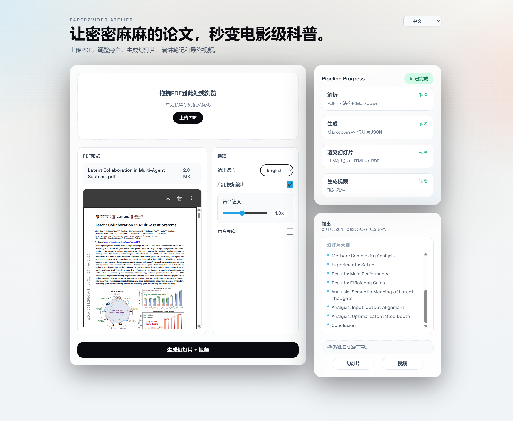

# Paper2Video



把论文变成清晰的讲解视频，具备 AI 驱动的旁白、自动幻灯片生成和专业视频制作功能。

[View in English](./README.md)

## 功能特点

- **PDF 分析**：使用 Docling 从研究论文中提取结构化内容
- **幻灯片生成**：AI 驱动的内容摘要和幻灯片布局设计
- **多语言支持**：生成英文或中文的幻灯片和旁白
- **声音克隆**：自定义 TTS 及声音样本克隆功能
- **视频制作**：从幻灯片自动生成视频，旁白同步
- **实时进度**：从解析到最终视频渲染的全程追踪

## 系统要求

### 1. Docling-serve 和 Podman

本项目使用 [Docling-serve](https://github.com/docling-project/docling-serve) 进行 PDF 解析，需要 [Podman](https://podman.io/) 来运行容器化服务。

**安装 Podman：**

```bash
# Ubuntu/Debian
sudo apt-get update
sudo apt-get install -y podman

# 或按照官方安装指南操作
# https://podman.io/docs/installation
```

### 2. GPU 支持（可选但推荐）

如果您有 NVIDIA GPU 并希望使用 GPU 加速：

1. 为您的系统安装 NVIDIA 驱动程序
2. 安装 nvidia-container-toolkit：

```bash
distribution=$(. /etc/os-release;echo $ID$VERSION_ID)
curl -s -L https://nvidia.github.io/nvidia-docker/gpgkey | sudo apt-key add -
curl -s -L https://nvidia.github.io/nvidia-docker/$distribution/nvidia-docker.list | \
  sudo tee /etc/apt/sources.list.d/nvidia-docker.list

sudo apt-get update
sudo apt-get install -y nvidia-container-toolkit
```

3. 生成 CDI 规范：

```bash
sudo nvidia-ctk cdi generate --output=/etc/cdi/nvidia.yaml
```

### 3. PDF 渲染的系统字体

幻灯片渲染需要系统字体支持。为了正确显示中文文本：

```bash
# 安装中文字体（Noto CJK）
sudo apt-get install fonts-noto-cjk

# 您也可以根据需要安装其他字体
sudo apt-get install fonts-noto-color-emoji
```

## 安装步骤

1. 克隆仓库：

```bash
git clone <仓库地址>
cd Paper2Video
```

2. 使用 Bun 安装依赖：

```bash
# 如果尚未安装 Bun
curl -fsSL https://bun.sh/install | bash

# 安装项目依赖
bun install
```

3. 配置环境变量：

```bash
cp .env.example .env
# 编辑 .env 文件，配置您的 API 密钥和设置
```

## 使用方法

### 开发模式

启动开发服务器：

```bash
bun run dev
```

应用将可在以下地址访问：
- **Next.js UI**: http://localhost:3000
- **Docling-serve API**: http://localhost:5001

### 生产构建

构建生产版本：

```bash
bun run build
bun run start
```

## 配置说明

### 环境变量

请参考 `.env.example` 文件了解可用的配置选项：

- `DOCLING_URL`: Docling-serve 端点（默认：`http://localhost:5001`）
- `LLM_API_KEY`: LLM 的 API 密钥（用于内容生成）
- 其他 TTS 和视频处理设置

## 贡献指南

欢迎贡献！请随时提交 Issue 和 Pull Request。

## 许可证

本项目采用 MIT 许可证。

## 致谢

- [Docling](https://github.com/docling-project/docling) 用于 PDF 解析
- [Next.js](https://nextjs.org/) 提供网页框架
- [Reveal.js](https://revealjs.com/) 提供幻灯片演示
- [Puppeteer](https://pptr.dev/) 用于 PDF 生成
