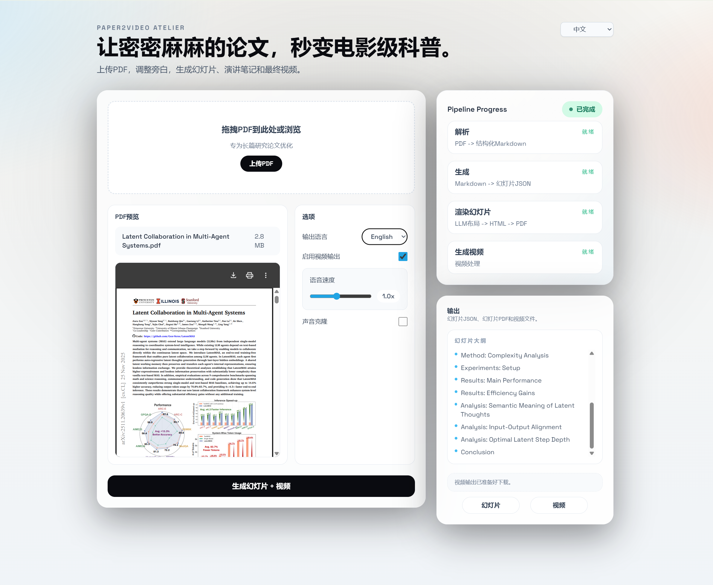

# Paper2Video



把论文变成清晰的讲解视频，具备 AI 驱动的旁白、自动幻灯片生成和专业视频制作功能。

[View in English](./README.md)

## 功能特点

- **PDF 分析**：使用 [MinerU](https://mineru.net/) 云端 API 从研究论文中提取结构化内容
- **幻灯片生成**：AI 驱动的内容摘要和幻灯片布局设计
- **多语言支持**：生成英文或中文的幻灯片和旁白
- **声音克隆**：自定义 TTS 及声音样本克隆功能
- **视频制作**：从幻灯片自动生成视频，旁白同步
- **实时进度**：从解析到最终视频渲染的全程追踪

## 系统要求

### 1. MinerU API 密钥

本项目使用 [MinerU](https://mineru.net/) 进行 PDF 解析。在 https://mineru.net/ 注册获取 API 密钥，然后在 `.env.local` 中设置 `MINERU_API_KEY`。

### 2. PDF 渲染的系统字体

幻灯片渲染需要系统字体支持。为了正确显示中文文本：

```bash
# 安装中文字体（Noto CJK）
sudo apt-get install fonts-noto-cjk

# 您也可以根据需要安装其他字体
sudo apt-get install fonts-noto-color-emoji
```

## 安装步骤

1. 克隆仓库：

```bash
git clone <仓库地址>
cd Paper2Video
```

2. 使用 Bun 安装依赖：

```bash
# 如果尚未安装 Bun
curl -fsSL https://bun.sh/install | bash

# 让当前 shell 可以直接使用 Bun
export PATH="$HOME/.bun/bin:$PATH"

# 安装项目依赖
bun install
```

3. 配置环境变量：

```bash
cp .env.example .env.local
# 如果需要实际跑完整流程，再编辑 .env.local 填入 API 密钥和设置
```

## 一键校验

在新的本地环境中，先安装一次 Playwright Chromium 浏览器：

```bash
bun run test:e2e:install
```

在 Ubuntu CI 中，需要连同系统依赖一起安装 Chromium：

```bash
bun run test:e2e:install:ci
```

然后执行完整校验：

```bash
bun run validate
```

`bun run validate` 会按顺序执行 `lint`、`test`、`test:e2e`、`build`。只做这套校验时，复制 `.env.example` 到 `.env.local` 就够了；只有在实际运行 PDF / LLM / TTS 流程时才需要填真实密钥。CI 里的 `.github/workflows/validate.yml` 也会搭配 `bun run test:e2e:install:ci`，这样文档和 CI 的浏览器安装方式保持一致。

## 使用方法

### 开发模式

启动开发服务器：

```bash
bun run dev
```

应用将可在 http://localhost:3000 访问

### 生产构建

构建生产版本：

```bash
bun run build
bun run start
```

## 配置说明

### 环境变量

请参考 `.env.example` 文件了解可用的配置选项：

- `MINERU_API_KEY`: MinerU API 密钥（用于 PDF 解析）
- `LLM_API_KEY`: LLM 的 API 密钥（用于内容生成）
- 其他 TTS 和视频处理设置

## 贡献指南

欢迎贡献！请随时提交 Issue 和 Pull Request。

## 许可证

本项目采用 MIT 许可证。

## 致谢

- [MinerU](https://mineru.net/) 用于 PDF 解析
- [Next.js](https://nextjs.org/) 提供网页框架
- [Reveal.js](https://revealjs.com/) 提供幻灯片演示
- [Puppeteer](https://pptr.dev/) 用于 PDF 生成
